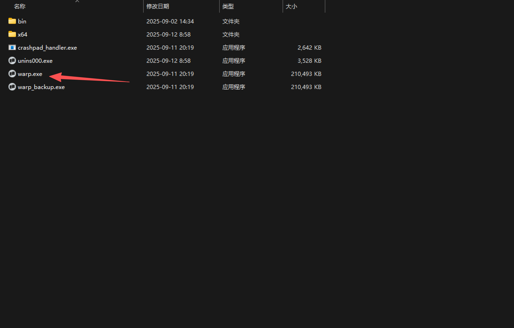
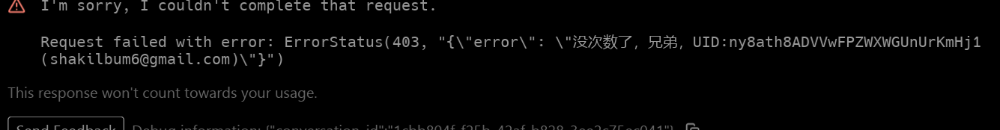

# 🚀 Warp Infinite - Warp无限对话工具（测试版）

## 📖 软件简介

**Warp Infinite** 是一个专为解决 Warp AI 应用对话限制问题而设计的工具。让你的 Warp 应用实现**无限对话，无需换号**！

## ✨ 主要特性

* 🔥 **无限对话** - 突破Warp对话次数限制，无需频繁换号
* 🔧 **自动证书管理** - 程序自动生成和安装SSL证书
* 🎯 **智能代理** - 仅代理必要请求，不影响其他应用
* 🖥️ **简洁GUI** - 一键启动，操作简单
* 🔒 **本地运行** - 所有处理本地进行，保护隐私
* 🛡️ **强制更新** - 确保使用最新版本，保证稳定性

## 📥 下载地址

**最新版本**: v1.05
**下载链接**: [GitHub Releases]

## 🎮 使用方法

1. **下载软件** - 下载 `warp.exe` 
2. **关闭VPN** - 确保关闭所有其他VPN软件
3. **选择路径** - 选择你的Warp应用程序路径

4. **自定义网关** - 点击"自定义"按钮配置如下

5. **运行Warp** - 正常使用Warp，享受无限对话

## ⚠️ 使用须知

* **测试版本** - 当前为测试阶段，可能存在不稳定因素
* **关闭VPN** - 使用前必须关闭其他VPN软件
* **版本检查** - 软件会自动检查版本，过期版本无法使用
* **停止时间** - 9月20日停止开放

## 📞 反馈与支持

* **GitHub Issues**: [提交问题]

## 👨‍💻 作者信息

**作者**: 林深时见鹿->天才只是见我的门槛
**版本**: v1.5 新测试版

**开放时间**: 至9月25日

---

## 🎯 测试反馈

欢迎大家测试使用并反馈问题！这是测试版本，主要用于验证功能稳定性和收集用户反馈。

**测试重点**:
* ✅ 软件启动时的版本检查是否正常
* ✅ 关闭VPN后代理是否能正常启动
* ✅ 对话限制是否成功突破
* ✅ 软件稳定性和兼容性
* Warp对话是否能正常突破限制
* 软件稳定性和兼容性
* 界面操作体验
* 证书安装是否正常

有任何问题欢迎在评论区反馈！🙏

---
## 🚨 使用流程总结

1. **联网启动** → 版本检查通过
2. **关闭VPN** → 确保网络环境干净
3. **启动代理** → 显示"代理服务已启动"
4. **运行Warp** → 用户状态变为"云端"
5. **无限对话** → 享受不受限制的体验

**⭐ 如果觉得有用，欢迎给项目点个Star支持一下！**
---
## 🚨 本次更新总结
1. **号池检测注册机在源源不断的推送号**
2. **个人令牌限制**
3. **账户的监控以及请求的监控**
4. **计费为按次，对话一次扣1，不按warp的token计算，更良心**
5. **次数面板，调整为后台配置的，并兼容无限量套餐**
6. **号池次数实时更新（有绑定账号的）**
7. **说白了就是即使你使用4.1蹬 对话一次也就是扣1额度**
8. ​**首次运行出现**

9. **吧这个图片内容复制出来发给我给你加额度**
​
